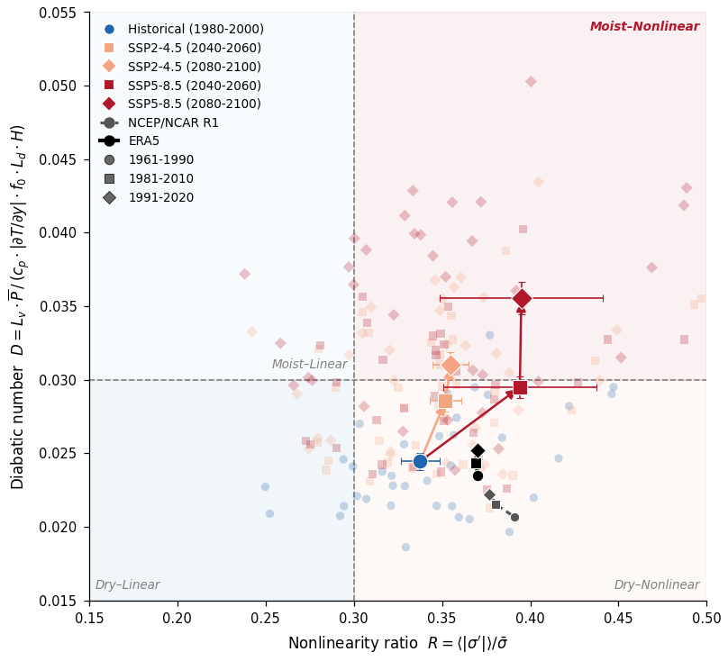

# CMIP6 Arctic Regime Diagram

Multi-model CMIP6 evidence for the Arctic atmosphere's transition from a **dry-linear** to a **moist-nonlinear** dynamical regime under climate change.

Accompanies the manuscript: *"Towards a theoretical understanding of Arctic amplification dynamics"* (Fallah et al., npj Climate and Atmospheric Science, 2026).

---

<p align="center">
  
</p>

**Figure:** Regime diagram for the Arctic atmosphere in the space of nonlinearity ratio *R* and diabatic number *D*, computed from 38 CMIP6 models (individual markers) and validated against ERA5 and NCEP/NCAR R1 reanalysis (30-year climatological windows). Large markers with error bars show the multi-model mean +/- 1 s.e.m. Arrows trace the trajectory under SSP2-4.5 (orange) and SSP5-8.5 (red).

---

## Dimensionless Parameters

| Parameter | Formula | Physical meaning |
|-----------|---------|-----------------|
| **R** (Nonlinearity ratio) | R = RMS(sigma') / sigma_bar | Amplitude of static stability perturbations relative to the climatological mean |
| **D** (Diabatic number) | D = Lv * P_bar / (cp * \|dT/dy\| * f0 * Ld * H) | Ratio of column-integrated latent heating to dry baroclinic energy scale |

where:
- sigma = -(Rd * T)/(p * theta) * d(theta)/dp is the static stability (Holton 2004)
- Ld = sqrt(sigma_bar) * Delta_p / f0 is the Rossby deformation radius from QG stretching
- dT/dy is evaluated at 700 hPa across 55-65 N (baroclinic zone)
- P_bar is area-weighted Arctic-mean (60-90 N) precipitation

## Quick Start

```bash
# 1. Create environment
conda env create -f environment.yml
conda activate arctic_regime

# 2. Run the full pipeline
bash scripts/run_all.sh

# Or run steps individually:
python scripts/01_download_data.py          # Download CMIP6 from Pangeo (~40 GB)
python scripts/02_compute_diagnostics.py    # Compute R and D per model
python scripts/04_reanalysis_diagnostics.py # ERA5 + NCEP/NCAR R1 diagnostics
python scripts/03_plot_regime_diagram.py    # Generate publication figure
```

## Pipeline

| Step | Script | Input | Output |
|------|--------|-------|--------|
| 1 | `01_download_data.py` | Pangeo Google Cloud CMIP6 catalog | `data/processed/*.nc` |
| 2 | `02_compute_diagnostics.py` | Processed NetCDF files | `data/diagnostics/regime_diagnostics.csv` |
| 3 | `04_reanalysis_diagnostics.py` | ERA5 (CDS API) + NCEP/NCAR R1 (NOAA PSL) | `data/diagnostics/reanalysis_diagnostics.csv` |
| 4 | `03_plot_regime_diagram.py` | Both diagnostic CSVs | `figures/regime_diagram.pdf` |

## CMIP6 Models (38)

ACCESS-CM2, AWI-CM-1-1-MR, BCC-CSM2-MR, CAMS-CSM1-0, CAS-ESM2-0, CESM2, CESM2-WACCM, CMCC-CM2-SR5, CMCC-ESM2, CNRM-CM6-1, CNRM-CM6-1-HR, CNRM-ESM2-1, CanESM5, CanESM5-CanOE, E3SM-1-1, EC-Earth3, EC-Earth3-CC, EC-Earth3-Veg, EC-Earth3-Veg-LR, FGOALS-f3-L, FGOALS-g3, FIO-ESM-2-0, GFDL-CM4, GFDL-ESM4, GISS-E2-1-G, GISS-E2-1-H, HadGEM3-GC31-LL, IITM-ESM, INM-CM4-8, INM-CM5-0, IPSL-CM6A-LR, KACE-1-0-G, KIOST-ESM, MIROC-ES2L, MIROC6, MPI-ESM1-2-HR, MPI-ESM1-2-LR, MRI-ESM2-0

Experiments: `historical` (1980-2000), `ssp245` and `ssp585` (2040-2060, 2080-2100).

## Reanalysis Validation

| Dataset | Resolution | Source | Windows |
|---------|-----------|--------|---------|
| ERA5 | 0.25 deg | Copernicus CDS API | 1961-1990, 1981-2010, 1991-2020 |
| NCEP/NCAR R1 | 2.5 deg | NOAA PSL (direct HTTP) | 1961-1990, 1981-2010, 1991-2020 |

## Configuration

All tunable parameters live in `config/config.yaml`:
- Physical constants (Rd, cp, Lv, f0, H)
- Spatial domain (Arctic 60-90 N, edge 55-65 N)
- Pressure layers (R: 700-1000 hPa, D: 500-850 hPa, gradient: 700 hPa)
- Time periods and plotting options

Model list: `config/models.yaml`

## Repository Structure

```
arctic_regime_diagram/
├── config/
│   ├── config.yaml           # Physical constants, domain, thresholds
│   └── models.yaml           # CMIP6 model list + ensemble members
├── src/
│   ├── config.py             # YAML config loader
│   ├── data/
│   │   ├── catalog.py        # Pangeo intake-esm catalog search
│   │   ├── download.py       # Lazy CMIP6 loading from Google Cloud
│   │   └── preprocess.py     # Arctic subsetting, regridding, area weights
│   ├── physics/
│   │   ├── static_stability.py  # theta, sigma(p), layer averaging
│   │   ├── nonlinearity.py      # R = RMS(sigma') / sigma_bar
│   │   └── diabatic.py          # dT/dy, Ld, D formula
│   └── plotting/
│       ├── style.py          # Nature Comms matplotlib rcParams
│       └── regime_diagram.py # 4-quadrant publication figure
├── scripts/
│   ├── 01_download_data.py
│   ├── 02_compute_diagnostics.py
│   ├── 03_plot_regime_diagram.py
│   ├── 04_reanalysis_diagnostics.py
│   └── run_all.sh
├── tests/
│   ├── test_static_stability.py
│   └── test_nonlinearity.py
├── data/                     # .gitignored
│   ├── processed/            # CMIP6 Arctic subsets
│   ├── diagnostics/          # CSV output tables
│   └── reanalysis/           # ERA5 + NCEP/NCAR R1
├── figures/
│   └── regime_diagram.pdf
└── environment.yml
```

## Tests

```bash
pytest tests/ -v
```

## License

MIT

## Citation

If you use this code, please cite:

> Fallah, B. et al. "Towards a theoretical understanding of Arctic amplification dynamics." *npj Climate and Atmospheric Science* (2026).
